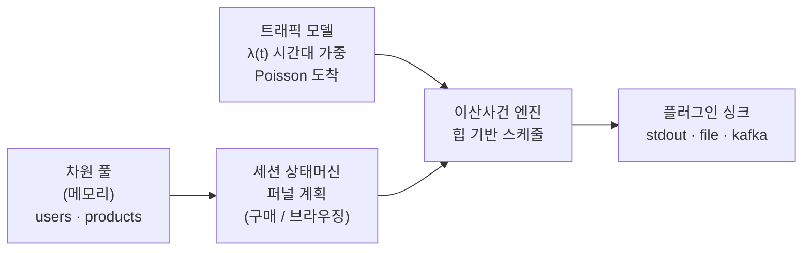

# real-time-data-generator

> 가짜 이커머스(온라인 쇼핑몰) **실시간 이벤트**를 끊임없이 흘려보내는 스트림 생성기입니다.

## 한 줄 요약

**"진짜 쇼핑몰처럼, 지금 이 순간에도 사람들이 둘러보고·검색하고·장바구니에 담고·주문하는 이벤트를 초 단위로 계속 만들어 스트리밍으로 내보내는 도구"** 입니다.

형제 프로젝트 [`ecommerce-data-generator`](https://github.com/hellojin97/ecommerce-data-generator)가 **배치**(과거 1년치를 한 번에 Parquet으로) 학습용이라면, 이 프로젝트는 **실시간 스트리밍** 학습용입니다. 같은 도메인(이커머스)·같은 현실성 설계(퍼널·세션·시간대 가중치·더티 데이터·시드 재현성)를 계승하되, **시간이 실제로 흐르면서** 이벤트가 발생하도록 바꿨습니다.

---

## 왜 필요한가요?

스트리밍 파이프라인(Kafka, Spark Structured Streaming, Flink 등)을 배우려면 **계속 흘러들어오는 데이터**가 필요합니다. 실제 트래픽은 구하기 어렵고, 너무 균일한 가짜 데이터는 현실과 달라 연습이 안 됩니다. 그래서 이 도구는:

- **시간대별로 트래픽이 출렁이고** (저녁 피크, 새벽 저점)
- **대부분은 둘러보다 이탈하고, 일부(2~5%)만 구매까지** 가고 (현실적 전환율)
- **일부 검색은 검색어가 비어 있는** (더티 데이터)

…현실처럼 적당히 지저분한 이벤트 스트림을 만듭니다.

---

## 무엇을 만드나요? (3개 논리 스트림)

| 스트림 | 내용 | 비고 |
|--------|------|------|
| **events** | 클릭스트림. `page_view → product_view → search → add_to_cart → begin_checkout → purchase` | 가장 많이 발생 |
| **orders** | 주문. 구매 전환 시 1건 생성 (라인아이템 내장) | events의 purchase와 `order_id`로 연결 |
| **payments** | 결제. 주문당 1건 (승인/실패/환불) | orders와 `order_id`로 연결 |

> Kafka 싱크에서는 스트림 = 토픽(`ecom.events` 등), file 싱크에서는 스트림 = 디렉토리입니다.

---

## 전체 그림



핵심은 **이산사건 시뮬레이션**입니다. 세션이 비균질 포아송 과정으로 태어나고, 각 세션이 만들 이벤트들이 시각순 힙에 쌓이며, 시계가 그 시각에 도달하면 싱크로 흘러나갑니다. 겹치는 세션들의 이벤트가 자연스럽게 인터리빙됩니다.

---

## 폴더 구조

```
real-time-data-generator/
├── src/realtime_generator/
│   ├── main.py          # CLI 진입점 (stream-data)
│   ├── config.yml       # 기본 설정값
│   ├── base.py          # 시드 RNG, 시간대 가중치(HOUR_WEIGHTS)
│   ├── clock.py         # 실시간/시뮬레이션 시계 추상화
│   ├── dimensions.py    # users/products 풀 (메모리 생성 또는 parquet 로드)
│   ├── traffic.py       # 시간대 가중 세션 도착 과정
│   ├── sessions.py      # 세션/퍼널 상태머신 (이벤트 계획)
│   ├── records.py       # event/order/payment 레코드 빌더
│   ├── engine.py        # 이산사건 메인 루프
│   └── sinks/           # 플러그인 싱크: stdout / file / kafka
└── tests/               # pytest (재현성·퍼널·싱크·트래픽)
```

---

## 사용 방법

### 1. 설치 (uv)

```bash
uv sync --dev                 # 런타임 + 개발(테스트/린트) 의존성
# 선택 extras:
uv sync --extra kafka         # Kafka 싱크 (confluent-kafka)
uv sync --extra parquet       # 배치 차원(parquet) 로드 (polars)
```

### 2. 빠르게 관찰 (stdout)

```bash
# 1000건만 즉시 생성해 JSONL로 출력 (배너/로그는 stderr라 파이프에 안 섞임)
uv run stream-data --simulated --max-events 1000 | head

# jq로 구매 이벤트만
uv run stream-data --simulated --max-events 2000 | jq 'select(.value.event_type=="purchase")'
```

### 3. 실시간으로 흘려보내기

```bash
# 평균 초당 5세션으로 60초간 실시간 스트리밍 (파일 싱크)
uv run stream-data --duration 60 --sessions-per-sec 5 --sink file --out-dir ./output/stream
```

### 4. 배치 차원 재사용

```bash
# ecommerce-data-generator가 만든 users/products.parquet를 그대로 참조
uv run stream-data --dim-parquet /path/to/raw --max-events 1000
```

### 5. Kafka로 스트리밍 (로컬 브로커)

`docker-compose.yml`로 단일노드 Kafka(KRaft, Zookeeper 불필요)를 띄우고 스트림을 produce합니다. 논리 스트림이 토픽이 됩니다: `ecom.events` / `ecom.orders` / `ecom.payments` (key=user_id/order_id로 파티셔닝).

```bash
uv sync --extra kafka                 # confluent-kafka 설치
docker compose up -d                  # 브로커 기동

# 30초간 Kafka로 흘려보내기
uv run stream-data --sink kafka --duration 30 --sessions-per-sec 5

# 토픽 소비해 확인
docker compose exec kafka /opt/kafka/bin/kafka-console-consumer.sh \
  --bootstrap-server localhost:9092 --topic ecom.events --from-beginning

docker compose down -v                # 정리
```

브로커 주소/토픽 프리픽스는 `config.yml`의 `sink.kafka`에서 바꿀 수 있습니다.

실브로커 왕복 통합 테스트(기본 스킵):

```bash
docker compose up -d
RUN_KAFKA_IT=1 uv run pytest tests/integration -q
```

### 6. Kafka 소비자 — Spark 윈도우 집계 (Phase 2)

생산한 스트림을 **읽어서** 실시간 집계하는 소비자입니다. `ecom.orders`를 이벤트타임 **1분 텀블링 윈도우**로 묶어 분당 매출·주문수를 콘솔에 출력하고, **워터마크**로 지각 데이터를 처리합니다. (pyspark가 `local[*]`로 임베디드 실행 — 별도 클러스터 불필요)

```bash
uv sync --extra spark                 # pyspark 설치 (Java 17+ 필요)
docker compose up -d                  # 브로커
uv run stream-data --sink kafka --duration 60 &   # 생산
uv run consume-orders                 # 소비/집계 (Ctrl-C 종료)
```

출력 예시:
```
+-------------------+-------------------+------+-----------+
|window_start       |window_end         |orders|revenue_usd|
+-------------------+-------------------+------+-----------+
|2025-01-01 00:00:00|2025-01-01 00:01:00|12    |2841.30    |
|2025-01-01 00:01:00|2025-01-01 00:02:00|9     |1990.55    |
+-------------------+-------------------+------+-----------+
```

옵션: `--topic`, `--window`(예: `'1 minute'`), `--watermark`(예: `'2 minutes'`), `--bootstrap`, `--starting-offsets`. 배우는 개념: **이벤트타임 윈도우 · 워터마크/지각 데이터 · 상태 저장 스트리밍 집계**.

### 7. 지각(late) 이벤트 주입 — 워터마크 실험

기본 스트림은 완벽하게 정렬되어 있어(이벤트 시각 = 도착 시각) 워터마크가 일하는 모습을 볼 수 없습니다. `--late-rate`를 주면 일부 레코드의 **방출(배달) 시각만** 뒤로 밀립니다 — 페이로드의 이벤트 시각(`order_ts` 등)은 그대로라, 이벤트타임 기준으로 뒤섞인(out-of-order) 스트림이 됩니다. 지연은 지수분포로 샘플링해 `--late-max-delay`(초)를 상한으로 절단합니다(대부분 짧게, 가끔 길게, 상한 보장).

지각 추출은 별도 rng(seed+2)를 쓰므로, **같은 시드에서 지각 옵션을 켜고 꺼도 생성되는 레코드 내용은 동일**하고 배달 시각만 달라집니다. 지각 없는 실행이 정답지(ground truth)가 되어 워터마크가 버린 데이터를 정량 측정할 수 있습니다.

```bash
# 실험 A: 최대 지각(90초) < 워터마크(2분) → 지각 주문도 전부 집계에 반영된다
uv run stream-data --sink kafka --duration 120 --late-rate 0.1 --late-max-delay 90 &
uv run consume-orders --watermark '2 minutes'

# 실험 B: 최대 지각(300초) > 워터마크(1분) → 일부 주문이 조용히 버려진다.
# 같은 시드의 지각 없는 실행과 분당 매출을 비교하면 유실률이 나온다.
uv run stream-data --sink kafka --duration 120 --late-rate 0.1 --late-max-delay 300 &
uv run consume-orders --watermark '1 minute'
```

### 주요 옵션

| 옵션 | 설명 |
|------|------|
| `--sink` | `stdout` \| `file` \| `kafka` |
| `--sessions-per-sec` | 하루 평균 세션 도착률(초당). 시간대 가중치로 실제 발생률은 변동 |
| `--conversion-rate` | 구매 전환율(0~1, 기본 0.04) |
| `--max-events` / `--duration` | 종료 조건(둘 다 없으면 무한, Ctrl-C로 중단) |
| `--late-rate` | 지각시킬 레코드 비율(0~1, 기본 0 = 비활성). 이벤트 시각은 그대로, 방출만 지연 |
| `--late-max-delay` | 지각 지연 상한(초, 기본 120). 지수분포 샘플을 이 값으로 절단 |
| `--simulated` | 가상 시계로 실제 대기 없이 즉시 생성(결정론·테스트·리플레이) |
| `--seed` | RNG 시드. 같은 값이면 (시뮬레이션 모드에서) 항상 같은 스트림 |
| `--dim-parquet` | 배치 산출물 경로에서 차원 로드 |

### 5. 테스트 / 린트

```bash
uv run pytest         # 전체 테스트
uv run ruff check .   # 코드 스타일 점검
```

---

## 재현성에 대하여

실시간은 본질적으로 벽시계 시간이 흐르지만, **무엇을 뽑을지**(어떤 유저/상품/세션 구조)는 시드로 고정됩니다. `--simulated` 모드에서는 가상 시계가 고정 시각에서 출발하므로 **같은 시드 → 완전히 동일한 레코드 스트림**이 재현됩니다(테스트·리플레이용).

---

## 기술 스택

- **Python 3.12** / **numpy**(샘플링) / **pyyaml**(설정)
- (선택) **confluent-kafka** — Kafka 싱크
- (선택) **polars** — 배치 Parquet 차원 로드
- (선택) **pyspark** — Spark Structured Streaming 소비자 (Phase 2)
- **uv** / **ruff** / **pytest**

## 로드맵

- [x] 코어 엔진 + stdout/file 싱크 + 테스트
- [x] Kafka 싱크 실연 + `docker-compose.yml`(로컬 브로커)
- [x] Spark Structured Streaming 소비 예제 (orders 1분 윈도우 집계 + 워터마크)
- [x] late/out-of-order 이벤트 주입 옵션 (`--late-rate` / `--late-max-delay`)
- [ ] 트래픽 스파이크(플래시세일) 시나리오 주입
- [ ] 소비자 확장: 실시간 전환율 / 인기 상품 Top-N
